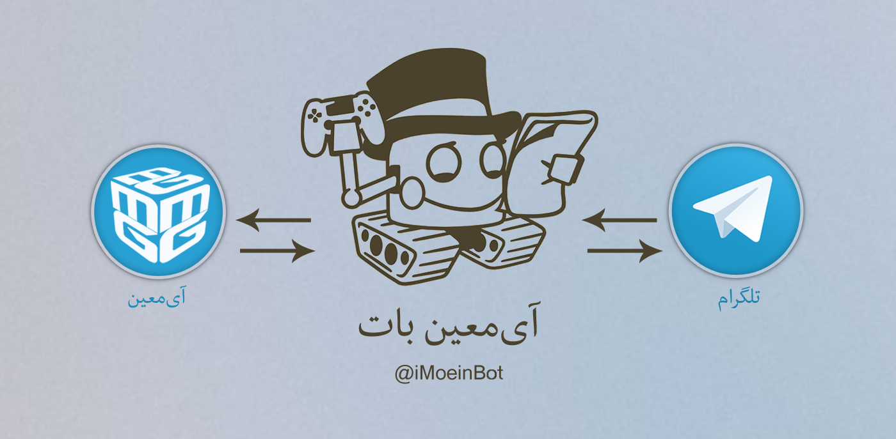

Telegram Bot for iMoein.com

#  Telegram Bot API PHP
>
Telegram is a messaging app with a focus on speed and security, it’s super fast, simple and free. You can use Telegram on all your devices at the same time — your messages sync seamlessly across any of your phones, tablets or computers.

With Telegram, you can send messages, photos, videos and files of any type (doc, zip, mp3, etc), as well as create groups for up to 200 people. You can write to your phone contacts and find people by their usernames. As a result, Telegram is like SMS and email combined — and can take care of all your personal or business messaging needs.

May. 2015: 2 billion messages daily, ~62 million Monthly Active Users.

## Requirements

- PHP 5.5 or higher
- MySQL
- Composer
- cURL
- Telegram app (mobile or desktop)

### My Bots :)

[@imoeinbot](https://telegram.me/imoeinbot)

### What is Telegram?
According to [Telegram](https://www.telegram.org/):
